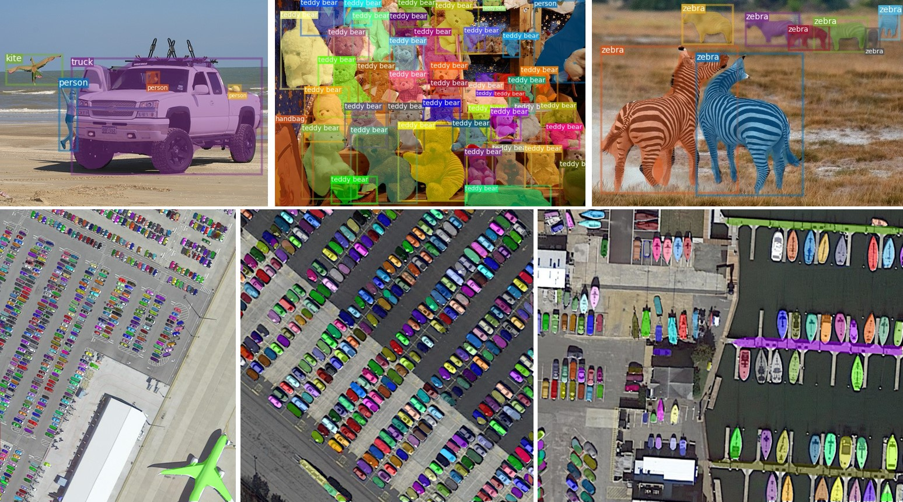
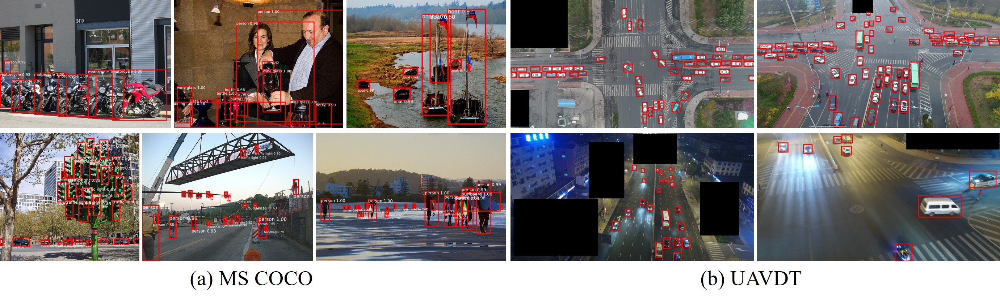

# D2Det-mmdet2.1

- The project adopts mmdetection v2.1.0 to re-implement the original [D2Det](https://github.com/JialeCao001/D2Det-mmdet2.1).
- The config files for large vocabulary datasets LVIS and Objects365 are also provided.

<table>
    <tr>
        <td ><center>  </center> </td>
    </tr>    
    <tr>
        <td ><center> </center> </td>
    </tr>
</table>

## Introduction
We propose a novel two-stage detection method, D2Det, that collectively addresses both precise localization and accurate classification. For precise localization, we introduce a dense local regression that predicts multiple dense box offsets for an object proposal. Different from traditional regression and keypoint-based localization employed in two-stage detectors, our dense local regression is not limited to a quantized set of keypoints within a fixed region and has the ability to regress position-sensitive real number dense offsets, leading to more precise localization. The dense local regression is further improved by a binary overlap prediction strategy that reduces the influence of background region on the final box regression. For accurate classification, we introduce a discriminative RoI pooling scheme that samples from various sub-regions of a proposal and performs adaptive weighting to obtain discriminative features.

## Installation
- Please refer to [INSTALL.md](docs/INSTALL.md) of mmdetection. 
- I use pytorch1.4.0, cuda10.0, and mmcv0.6.1.

## Train and Inference
Please use the following commands for training and testing by single GPU or multiple GPUs.


#####  Train with a single GPU
```shell
python tools/train.py ${CONFIG_FILE}
```

#####  Train with multiple GPUs

```shell
./tools/dist_train.sh ${CONFIG_FILE} ${GPU_NUM} [optional arguments]
```
#####  Test with a single GPU

```shell
python tools/test.py ${CONFIG_FILE} ${CHECKPOINT_FILE} [--out ${RESULT_FILE}] [--eval ${EVAL_METRICS}] [--show]
```

#####  Test with multiple GPUs

```shell
./tools/dist_test.sh ${CONFIG_FILE} ${CHECKPOINT_FILE} ${GPU_NUM} [--out ${RESULT_FILE}] [--eval ${EVAL_METRICS}]
```

- CONFIG_FILE about D2Det is in [configs/d2det](configs/d2det), please refer to [GETTING_STARTED.md](docs/GETTING_STARTED.md) for more details.


## Demo


With your trained model, detection results of an image can be visualized using the following command.
```shell
python ./demo/D2Det_demo.py ${CONFIG_FILE} ${CHECKPOINT_FILE} ${IMAGE_FILE} [--out ${OUT_PATH}]
e.g.,
python ./demo/D2Det_demo.py ./configs/d2det/D2Det_instance_r50_fpn_lvis.py ./D2Det_instance_r50_fpn_lvis.pth ./demo/demo.jpg --out ./demo/lvis.jpg
```

## Citation
If the project helps your research, please cite this paper.

```
@article{Cao_D2Det_CVPR_2020,
  author =       {Jiale Cao and Hisham Cholakkal and Rao Muhammad Anwer and Fahad Shahbaz Khan and Yanwei Pang and Ling Shao},
  title =        {D2Det: Towards High Quality Object Detection and Instance Segmentation},
  journal =      {Proc. IEEE Conference on Computer Vision and Pattern Recognition},
  year =         {2020}
}
```

## Acknowledgement
Many thanks to the open source codes, i.e., [mmdetection](https://github.com/open-mmlab/mmdetection) and [Grid R-CNN plus](https://github.com/STVIR/Grid-R-CNN).
